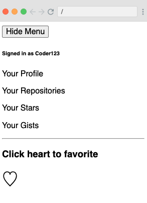
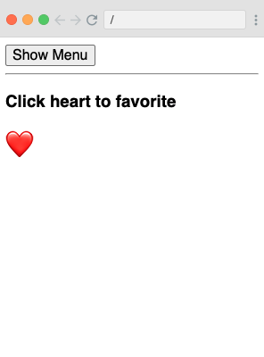

# Higher Order Component/Render props

## Using a Toggler component to avoid repeating logic in 2 similar components

### Click button to toggle stats, click heart to toggle fill/empty heart. Ultimately went with render props instead of HOC

